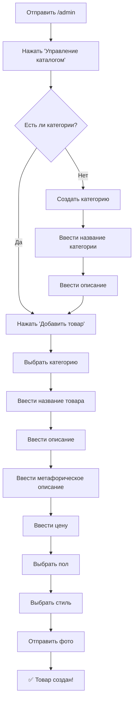

# 🔄 Схема работы с админ панелью

## 📊 Процесс добавления товара



## 🎯 Пошаговая инструкция

### 1️⃣ Запуск админ панели
```
Команда: /admin
Результат: Главное меню администратора
```

### 2️⃣ Переход к каталогу
```
Кнопка: 📦 Управление каталогом
Результат: Меню управления каталогом
```

### 3️⃣ Создание категории (если нужно)
```
Кнопка: ➕ Добавить категорию
Шаги:
  1. Название: "Солнцезащитные очки"
  2. Описание: "Стильные очки для защиты от солнца"
```

### 4️⃣ Добавление товара
```
Кнопка: ➕ Добавить товар
Шаги:
  1. Категория: Выбрать из списка
  2. Название: "Ray-Ban Aviator"
  3. Описание: "Классические авиаторы..."
  4. Метафорическое: "Почувствуйте себя пилотом..."
  5. Цена: 15000
  6. Пол: Унисекс
  7. Стиль: Классический
  8. Фото: Отправить изображение
```

## 🔧 Команды администратора

| Команда | Описание |
|---------|----------|
| `/admin` | Главное меню администратора |
| `/stats` | Быстрый доступ к статистике |
| `/mailing` | Быстрый доступ к рассылкам |

## 📋 Структура меню

```
🏠 Главное меню админа
├── 📦 Управление каталогом
│   ├── 📂 Категории
│   ├── 📦 Товары
│   ├── ➕ Добавить категорию
│   └── ➕ Добавить товар
├── 📋 Управление заказами
│   ├── 📊 Все заказы
│   ├── 🆕 Новые заказы
│   └── 📈 Статистика заказов
├── 🎫 Управление промокодами
│   ├── 📋 Все промокоды
│   ├── ➕ Создать промокод
│   └── 📊 Статистика использования
├── 📧 Управление рассылками
│   ├── 📋 История рассылок
│   ├── ➕ Новая рассылка
│   └── ⏰ Запланированные
├── 📈 Статистика
│   ├── 👥 Пользователи
│   ├── 💰 Продажи
│   ├── 🎯 Конверсия AIDA
│   └── 📊 Общая статистика
├── ❓ Управление FAQ
│   ├── 📋 Все вопросы
│   ├── ➕ Добавить вопрос
│   └── ✏️ Редактировать
└── ⚙️ Настройки
    ├── 🔧 Конфигурация
    ├── 📝 Логи
    └── 🔄 Перезапуск
```

## 🎨 Примеры контента

### 📝 Хорошие названия товаров:
- ✅ "Ray-Ban Aviator Classic RB3025"
- ✅ "Oakley Holbrook Polarized"
- ✅ "Chanel CH3281 Butterfly"
- ❌ "Очки 1", "Товар 123"

### 📄 Хорошие описания:
- ✅ "Классические очки-авиаторы с металлической оправой золотистого цвета и поляризованными линзами. Защита UV400. Размер: 58-14-135."
- ❌ "Хорошие очки"

### 🎭 Метафорические описания:
- ✅ "Почувствуйте себя пилотом истребителя! Эти легендарные авиаторы превратят каждый ваш выход в триумфальное шествие."
- ✅ "Воплощение французской элегантности. Каждый взгляд через эти очки - произведение искусства."
- ❌ "Красивые очки для всех"

## 🚨 Частые ошибки

### ❌ Что НЕ делать:
1. Не указывать цену в копейках (15000.50 вместо 15000)
2. Не загружать фото низкого качества
3. Не писать скучные описания
4. Не забывать про метафорические описания
5. Не создавать товары без категорий

### ✅ Что делать ПРАВИЛЬНО:
1. Использовать качественные фото (минимум 800x600)
2. Писать эмоциональные метафорические описания
3. Указывать точные характеристики в обычном описании
4. Создавать логичную структуру категорий
5. Регулярно проверять наличие товаров

## 📊 Мониторинг результатов

### 📈 Ключевые метрики:
- Количество просмотров каталога
- Конверсия из просмотра в корзину
- Конверсия из корзины в заказ
- Средний чек
- Популярные товары

### 🎯 Оптимизация:
1. Анализируйте какие товары чаще покупают
2. Обновляйте метафорические описания
3. Тестируйте разные цены
4. Добавляйте новые категории по запросам
5. Используйте промокоды для стимулирования продаж

---

**Готово!** Теперь у вас есть полное понимание работы с админ панелью! 🚀