# 🔄 API Потоки и Взаимодействия @imbabo_bot_v2

## 📋 Обзор API Потоков

Документ описывает все потоки взаимодействия пользователей и администраторов с ботом, включая FSM состояния и бизнес-логику.

## 👤 Пользовательские Потоки

### 🚀 Поток Регистрации и Приветствия

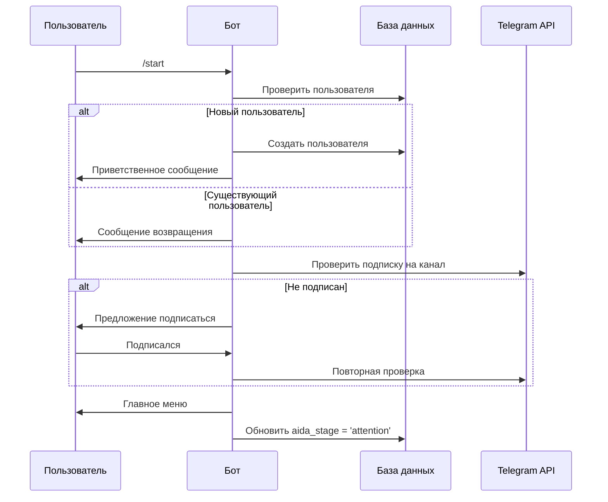

**Обработчик:** `app/handlers/user/common.py:start_command`

### 🛍️ Поток Просмотра Каталога

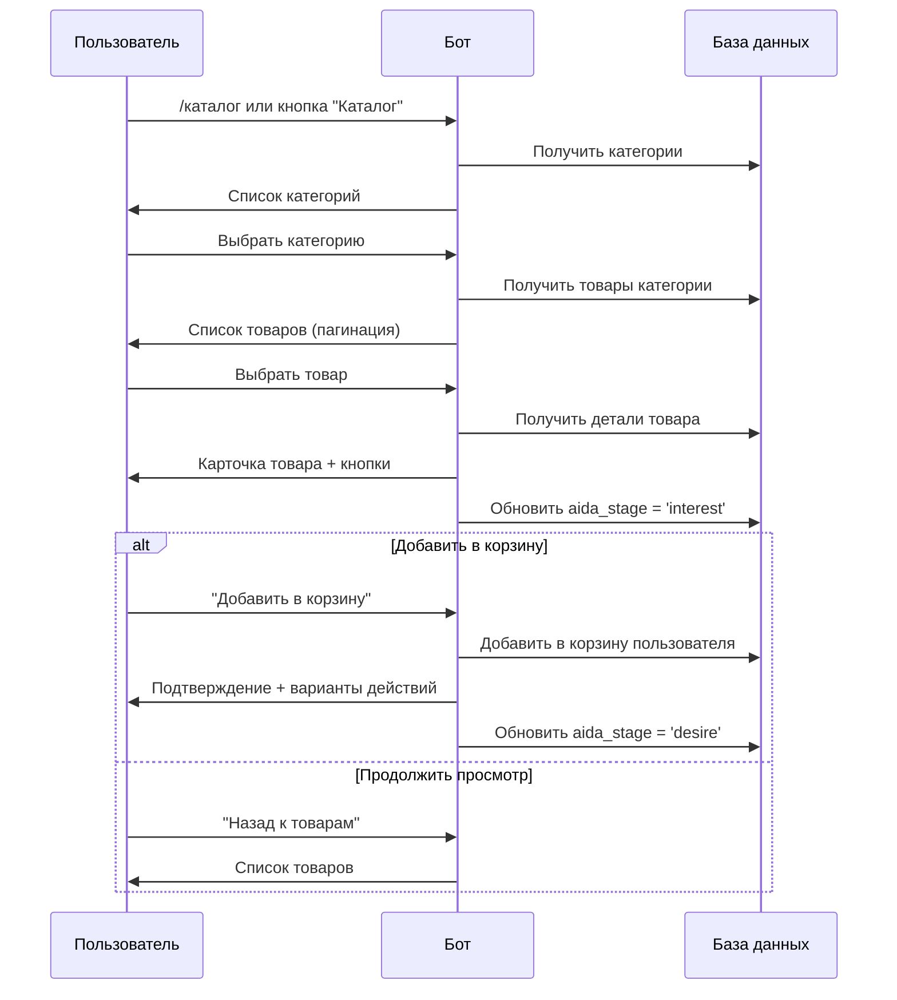

**Обработчики:** 
- `app/handlers/user/catalog.py`
- `app/services/cart_service.py`

### 🎯 Поток Персонального Подбора

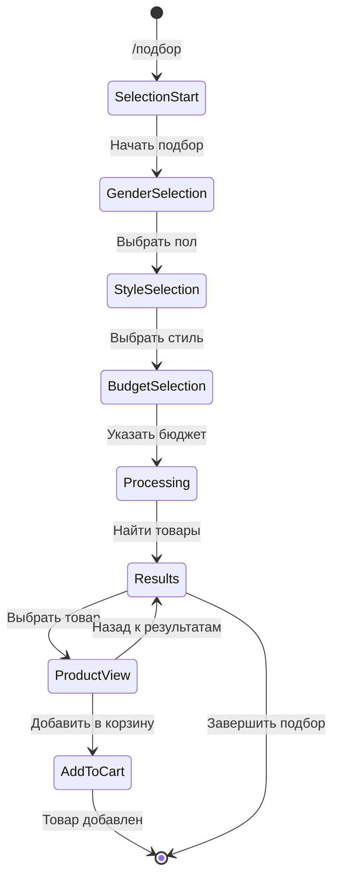

**FSM Состояния:**
```python
class PersonalSelectionStates(StatesGroup):
    waiting_for_gender = State()
    waiting_for_style = State()
    waiting_for_budget = State()
```

**Обработчик:** `app/handlers/user/personal_selection.py`

### 🛒 Поток Оформления Заказа

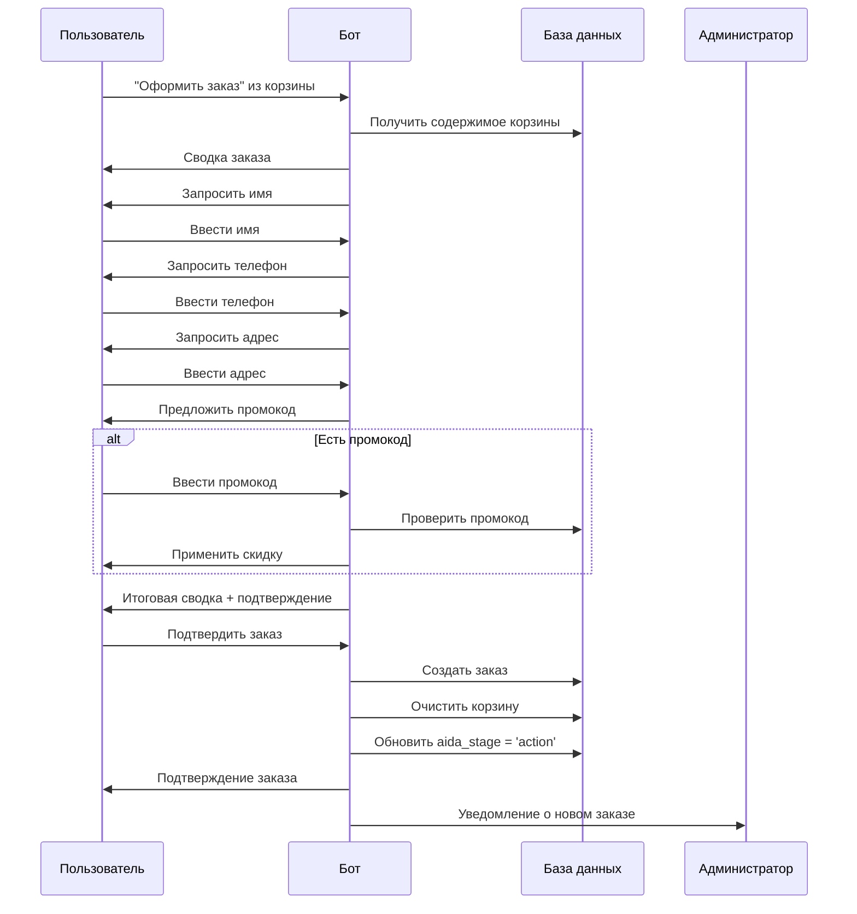

**FSM Состояния:**
```python
class OrderStates(StatesGroup):
    waiting_for_name = State()
    waiting_for_phone = State()
    waiting_for_address = State()
    waiting_for_promo = State()
    waiting_for_confirmation = State()
```

**Обработчик:** `app/handlers/user/orders.py`

### ⭐ Поток Сбора Отзывов

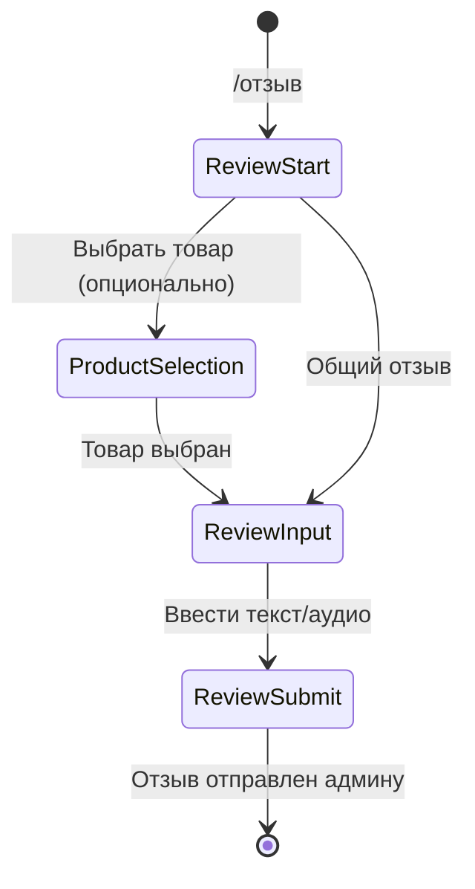

**Обработчик:** `app/handlers/user/reviews.py`

## 👨‍💼 Административные Потоки

### 📦 Поток Управления Каталогом

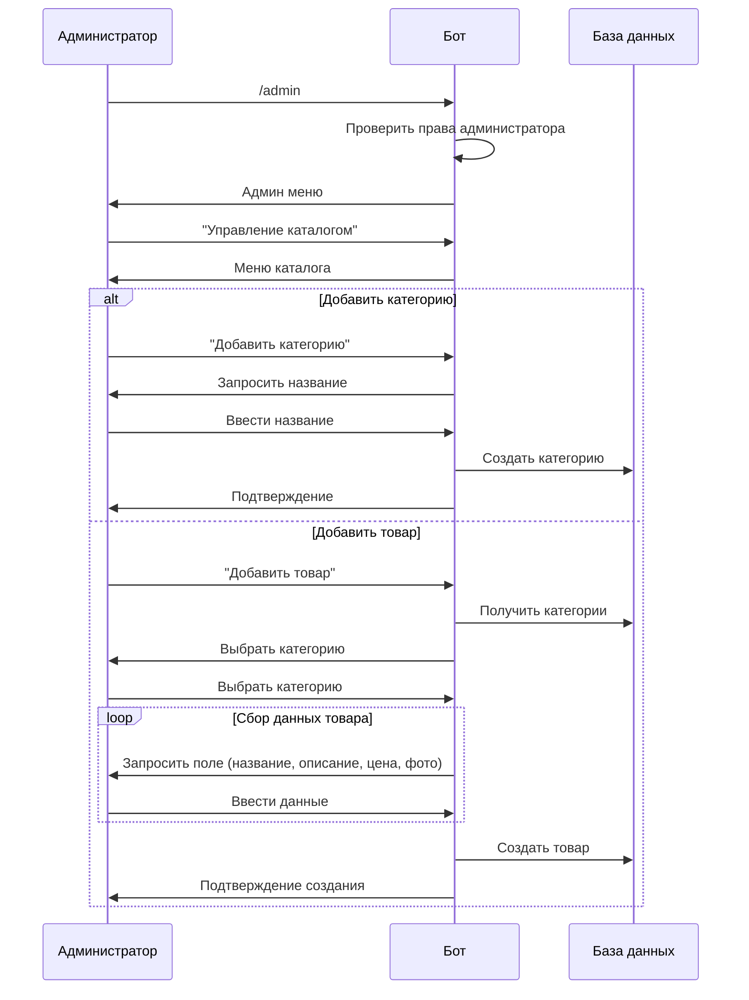

**FSM Состояния:**
```python
class ProductStates(StatesGroup):
    waiting_for_category = State()
    waiting_for_name = State()
    waiting_for_description = State()
    waiting_for_metaphoric_description = State()
    waiting_for_price = State()
    waiting_for_photo = State()
    waiting_for_gender = State()
    waiting_for_style = State()

class CategoryStates(StatesGroup):
    waiting_for_name = State()
    waiting_for_description = State()
```

**Обработчик:** `app/handlers/admin/catalog.py`

### 🎫 Поток Управления Промокодами

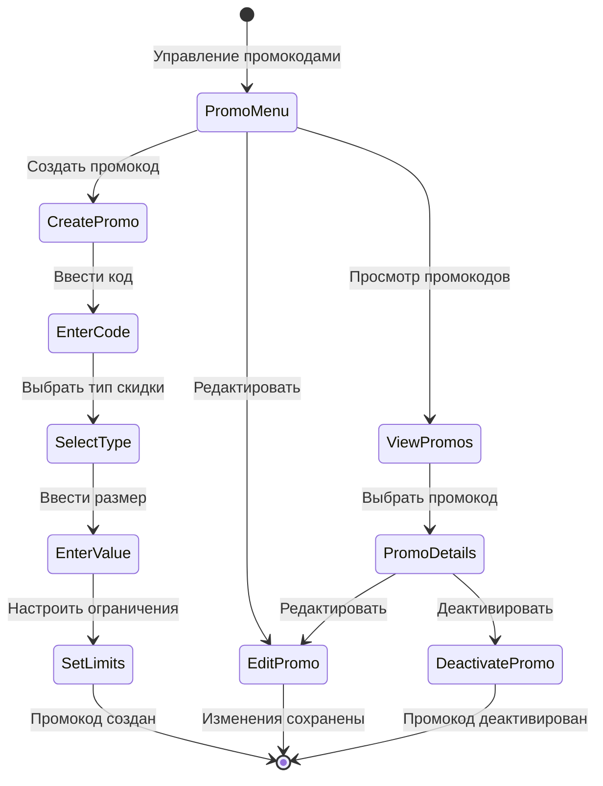

**Обработчик:** `app/handlers/admin/promo.py`

### 📊 Поток Просмотра Статистики

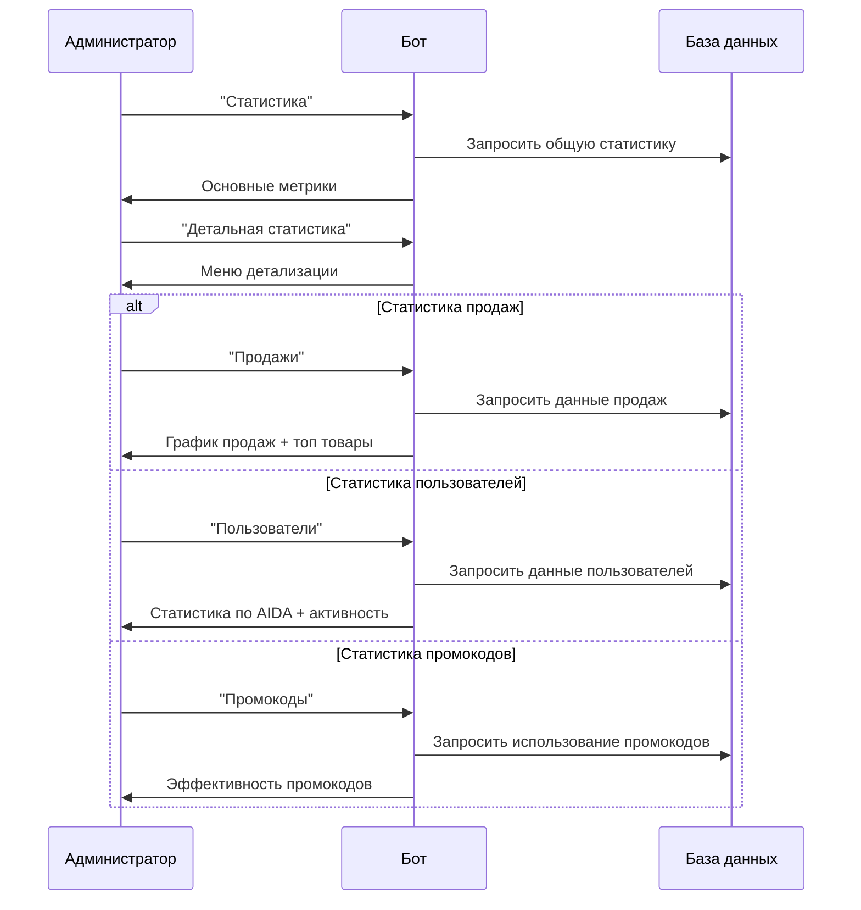

**Обработчик:** `app/handlers/admin/stats.py`

## 🔄 Автоматические Потоки

### 📧 Поток Рассылок

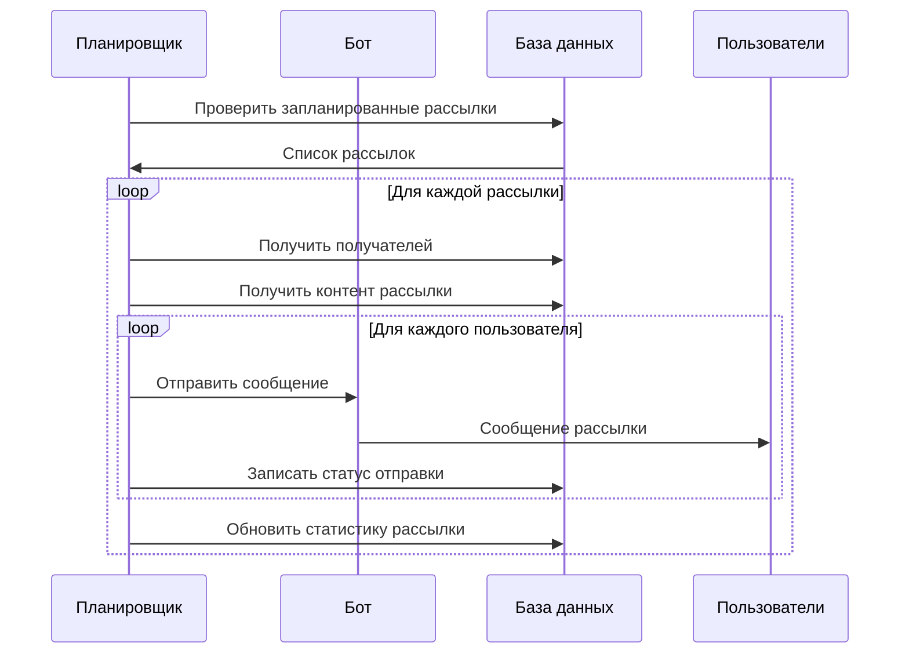

**Сервис:** `app/services/mailing_service.py`

### 🔔 Поток Ретаргетинга (Брошенные корзины)

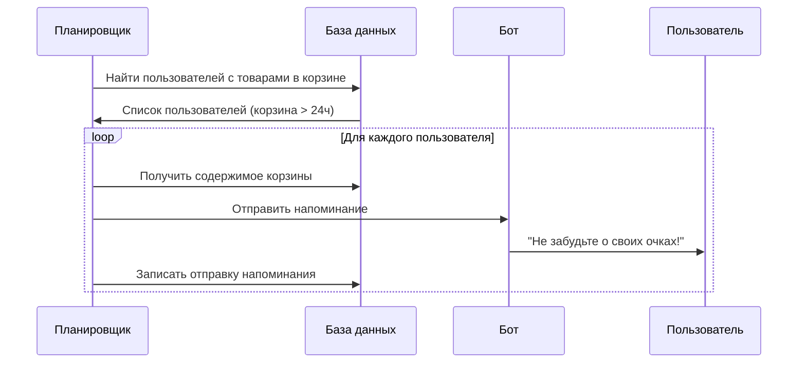

**Планировщик:** `app/scheduler.py`

### 📱 Поток Автопостинга в Канал

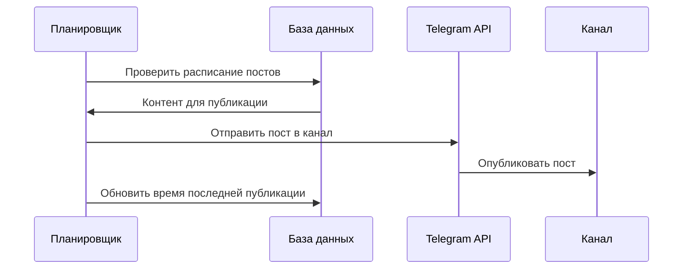

## 🔐 Middleware и Безопасность

### 🛡️ Поток Проверки Прав

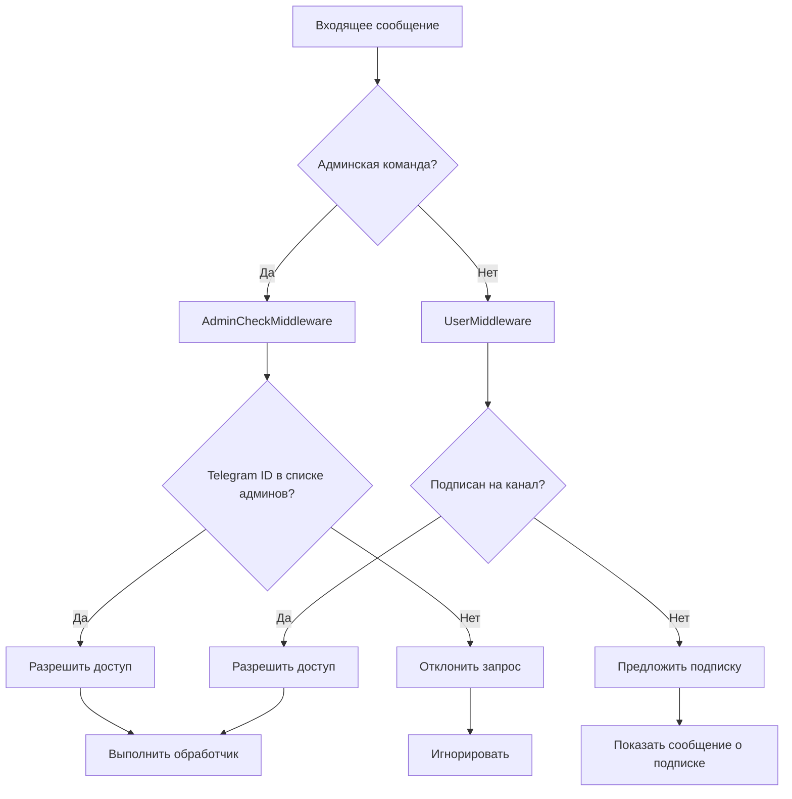

**Middleware:** 
- `app/middlewares/admin_check.py`
- `app/middlewares/subscription_check.py`

## 📊 Метрики и Аналитика

### 📈 Отслеживание AIDA Воронки

```python
# Обновление этапа AIDA
async def update_aida_stage(user_id: int, stage: str):
    """
    Stages: attention -> interest -> desire -> action
    """
    await user_crud.update_aida_stage(user_id, stage)
    
    # Логирование для аналитики
    logger.info(f"User {user_id} moved to AIDA stage: {stage}")
```

### 📊 Конверсионная Аналитика

```sql
-- Конверсия по этапам AIDA
WITH aida_funnel AS (
    SELECT 
        aida_stage,
        COUNT(*) as users_count
    FROM users 
    GROUP BY aida_stage
)
SELECT 
    aida_stage,
    users_count,
    LAG(users_count) OVER (ORDER BY 
        CASE aida_stage
            WHEN 'attention' THEN 1
            WHEN 'interest' THEN 2  
            WHEN 'desire' THEN 3
            WHEN 'action' THEN 4
        END
    ) as prev_stage_count,
    ROUND(
        users_count * 100.0 / LAG(users_count) OVER (ORDER BY 
            CASE aida_stage
                WHEN 'attention' THEN 1
                WHEN 'interest' THEN 2
                WHEN 'desire' THEN 3
                WHEN 'action' THEN 4
            END
        ), 2
    ) as conversion_rate
FROM aida_funnel;
```

## 🔄 Обработка Ошибок

### ⚠️ Стратегия Обработки Ошибок

```python
@error_handler
async def handle_telegram_error(update: Update, exception: Exception):
    """Глобальный обработчик ошибок"""
    
    if isinstance(exception, TelegramBadRequest):
        # Обработка ошибок Telegram API
        logger.warning(f"Telegram API error: {exception}")
        
    elif isinstance(exception, DatabaseError):
        # Ошибки базы данных
        logger.error(f"Database error: {exception}")
        await send_error_to_admin(exception)
        
    elif isinstance(exception, ValidationError):
        # Ошибки валидации
        await update.message.reply_text(
            "❌ Некорректные данные. Попробуйте еще раз."
        )
    
    else:
        # Неожиданные ошибки
        logger.critical(f"Unexpected error: {exception}")
        await send_error_to_admin(exception)
```

Эта архитектура API обеспечивает:
- ✅ Четкое разделение пользовательских и административных потоков
- ✅ Надежную обработку состояний FSM
- ✅ Автоматизацию маркетинговых процессов
- ✅ Безопасность и контроль доступа
- ✅ Детальную аналитику и метрики