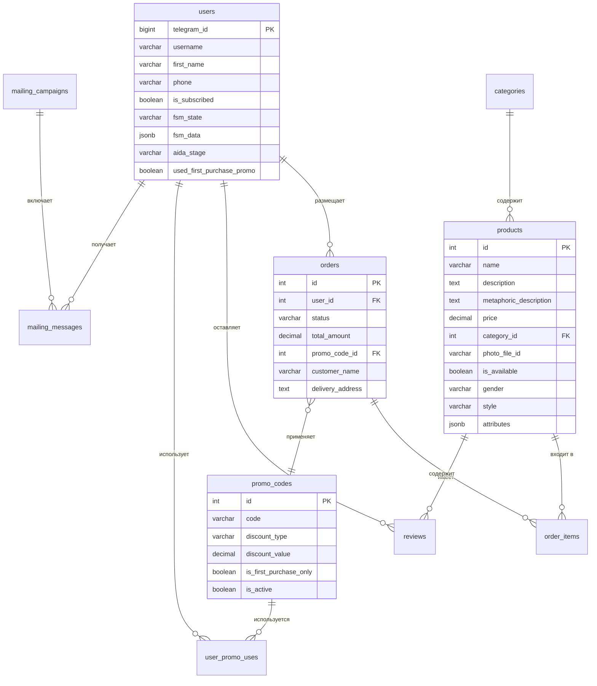

# 🗄️ Схема Базы Данных @imbabo_bot_v2

## 📊 Обзор Схемы

База данных спроектирована для поддержки полного цикла продаж очков через Telegram-бота с административной панелью и маркетинговыми механиками.

## 🗂️ Таблицы и Связи

### 👤 Пользователи (`users`)

```sql
CREATE TABLE users (
    id SERIAL PRIMARY KEY,
    telegram_id BIGINT UNIQUE NOT NULL,
    username VARCHAR(255),
    first_name VARCHAR(255),
    last_name VARCHAR(255),
    phone VARCHAR(20),
    email VARCHAR(255),
    is_subscribed BOOLEAN DEFAULT FALSE,
    registration_date TIMESTAMP DEFAULT CURRENT_TIMESTAMP,
    last_activity TIMESTAMP DEFAULT CURRENT_TIMESTAMP,
    fsm_state VARCHAR(100),
    fsm_data JSONB,
    aida_stage VARCHAR(20) DEFAULT 'attention',
    used_first_purchase_promo BOOLEAN DEFAULT FALSE,
    total_orders INTEGER DEFAULT 0,
    total_spent DECIMAL(10,2) DEFAULT 0,
    is_active BOOLEAN DEFAULT TRUE
);
```

**Описание полей:**
- `telegram_id` - Уникальный ID пользователя в Telegram
- `fsm_state` - Текущее состояние в машине состояний
- `fsm_data` - Данные состояния (JSON)
- `aida_stage` - Этап в воронке AIDA
- `used_first_purchase_promo` - Использовал ли промокод первой покупки

### 📂 Категории (`categories`)

```sql
CREATE TABLE categories (
    id SERIAL PRIMARY KEY,
    name VARCHAR(255) NOT NULL,
    description TEXT,
    is_active BOOLEAN DEFAULT TRUE,
    sort_order INTEGER DEFAULT 0,
    created_at TIMESTAMP DEFAULT CURRENT_TIMESTAMP
);
```

### 👓 Товары (`products`)

```sql
CREATE TABLE products (
    id SERIAL PRIMARY KEY,
    name VARCHAR(255) NOT NULL,
    description TEXT,
    metaphoric_description TEXT,
    price DECIMAL(10,2) NOT NULL,
    category_id INTEGER REFERENCES categories(id),
    photo_url VARCHAR(500),
    photo_file_id VARCHAR(255),
    is_available BOOLEAN DEFAULT TRUE,
    stock_quantity INTEGER DEFAULT 0,
    gender VARCHAR(20) DEFAULT 'unisex',
    style VARCHAR(50),
    attributes JSONB,
    is_featured BOOLEAN DEFAULT FALSE,
    is_unique BOOLEAN DEFAULT FALSE,
    sort_order INTEGER DEFAULT 0,
    created_at TIMESTAMP DEFAULT CURRENT_TIMESTAMP,
    updated_at TIMESTAMP DEFAULT CURRENT_TIMESTAMP
);
```

**Описание полей:**
- `metaphoric_description` - Эмоциональное описание для маркетинга
- `gender` - Пол: 'male', 'female', 'unisex'
- `style` - Стиль: 'classic', 'fashion', 'sport'
- `attributes` - Дополнительные атрибуты (JSON)
- `is_featured` - Рекомендуемый товар
- `is_unique` - Уникальная/редкая модель

### 🛒 Заказы (`orders`)

```sql
CREATE TABLE orders (
    id SERIAL PRIMARY KEY,
    user_id INTEGER REFERENCES users(id),
    status VARCHAR(50) DEFAULT 'new',
    total_amount DECIMAL(10,2) NOT NULL,
    promo_code_id INTEGER REFERENCES promo_codes(id),
    discount_amount DECIMAL(10,2) DEFAULT 0,
    customer_name VARCHAR(255),
    customer_phone VARCHAR(20),
    delivery_address TEXT,
    notes TEXT,
    created_at TIMESTAMP DEFAULT CURRENT_TIMESTAMP,
    updated_at TIMESTAMP DEFAULT CURRENT_TIMESTAMP
);
```

**Статусы заказов:**
- `new` - Новый заказ
- `processing` - В обработке
- `shipped` - Отправлен
- `delivered` - Доставлен
- `cancelled` - Отменен

### 📦 Состав заказов (`order_items`)

```sql
CREATE TABLE order_items (
    id SERIAL PRIMARY KEY,
    order_id INTEGER REFERENCES orders(id),
    product_id INTEGER REFERENCES products(id),
    quantity INTEGER NOT NULL DEFAULT 1,
    price DECIMAL(10,2) NOT NULL,
    created_at TIMESTAMP DEFAULT CURRENT_TIMESTAMP
);
```

### 🎫 Промокоды (`promo_codes`)

```sql
CREATE TABLE promo_codes (
    id SERIAL PRIMARY KEY,
    code VARCHAR(50) UNIQUE NOT NULL,
    discount_type VARCHAR(20) NOT NULL,
    discount_value DECIMAL(10,2) NOT NULL,
    min_order_amount DECIMAL(10,2) DEFAULT 0,
    max_uses INTEGER,
    current_uses INTEGER DEFAULT 0,
    is_first_purchase_only BOOLEAN DEFAULT FALSE,
    is_active BOOLEAN DEFAULT TRUE,
    valid_from TIMESTAMP DEFAULT CURRENT_TIMESTAMP,
    valid_until TIMESTAMP,
    created_at TIMESTAMP DEFAULT CURRENT_TIMESTAMP
);
```

**Типы скидок:**
- `percentage` - Процентная скидка
- `fixed` - Фиксированная сумма

### 🎫 Использование промокодов (`user_promo_uses`)

```sql
CREATE TABLE user_promo_uses (
    id SERIAL PRIMARY KEY,
    user_id INTEGER REFERENCES users(id),
    promo_code_id INTEGER REFERENCES promo_codes(id),
    order_id INTEGER REFERENCES orders(id),
    used_at TIMESTAMP DEFAULT CURRENT_TIMESTAMP,
    UNIQUE(user_id, promo_code_id)
);
```

### ⭐ Отзывы (`reviews`)

```sql
CREATE TABLE reviews (
    id SERIAL PRIMARY KEY,
    user_id INTEGER REFERENCES users(id),
    product_id INTEGER REFERENCES products(id),
    rating INTEGER CHECK (rating >= 1 AND rating <= 5),
    text_content TEXT,
    audio_file_id VARCHAR(255),
    is_moderated BOOLEAN DEFAULT FALSE,
    is_approved BOOLEAN DEFAULT FALSE,
    created_at TIMESTAMP DEFAULT CURRENT_TIMESTAMP
);
```

### ❓ FAQ (`faq`)

```sql
CREATE TABLE faq (
    id SERIAL PRIMARY KEY,
    question TEXT NOT NULL,
    answer TEXT NOT NULL,
    category VARCHAR(100),
    sort_order INTEGER DEFAULT 0,
    is_active BOOLEAN DEFAULT TRUE,
    created_at TIMESTAMP DEFAULT CURRENT_TIMESTAMP
);
```

### 📧 Рассылки (`mailing_campaigns`)

```sql
CREATE TABLE mailing_campaigns (
    id SERIAL PRIMARY KEY,
    name VARCHAR(255) NOT NULL,
    message_text TEXT NOT NULL,
    photo_file_id VARCHAR(255),
    keyboard_data JSONB,
    target_segment VARCHAR(100) DEFAULT 'all',
    status VARCHAR(50) DEFAULT 'draft',
    scheduled_at TIMESTAMP,
    sent_at TIMESTAMP,
    total_recipients INTEGER DEFAULT 0,
    successful_sends INTEGER DEFAULT 0,
    failed_sends INTEGER DEFAULT 0,
    created_at TIMESTAMP DEFAULT CURRENT_TIMESTAMP
);
```

### 📧 Отправленные сообщения (`mailing_messages`)

```sql
CREATE TABLE mailing_messages (
    id SERIAL PRIMARY KEY,
    campaign_id INTEGER REFERENCES mailing_campaigns(id),
    user_id INTEGER REFERENCES users(id),
    status VARCHAR(50) DEFAULT 'pending',
    sent_at TIMESTAMP,
    error_message TEXT,
    created_at TIMESTAMP DEFAULT CURRENT_TIMESTAMP
);
```

### 📱 Автопостинг (`autopost_content`)

```sql
CREATE TABLE autopost_content (
    id SERIAL PRIMARY KEY,
    title VARCHAR(255),
    content TEXT NOT NULL,
    photo_file_id VARCHAR(255),
    keyboard_data JSONB,
    post_type VARCHAR(50) DEFAULT 'regular',
    is_active BOOLEAN DEFAULT TRUE,
    scheduled_time TIME,
    last_posted TIMESTAMP,
    created_at TIMESTAMP DEFAULT CURRENT_TIMESTAMP
);
```

## 🔗 Связи между таблицами



## 📊 Индексы для Производительности

```sql
-- Основные индексы
CREATE INDEX idx_users_telegram_id ON users(telegram_id);
CREATE INDEX idx_products_category_id ON products(category_id);
CREATE INDEX idx_products_is_available ON products(is_available);
CREATE INDEX idx_orders_user_id ON orders(user_id);
CREATE INDEX idx_orders_status ON orders(status);
CREATE INDEX idx_order_items_order_id ON order_items(order_id);
CREATE INDEX idx_order_items_product_id ON order_items(product_id);
CREATE INDEX idx_promo_codes_code ON promo_codes(code);
CREATE INDEX idx_reviews_product_id ON reviews(product_id);
CREATE INDEX idx_reviews_user_id ON reviews(user_id);

-- Составные индексы
CREATE INDEX idx_products_category_available ON products(category_id, is_available);
CREATE INDEX idx_orders_user_status ON orders(user_id, status);
CREATE INDEX idx_user_promo_user_promo ON user_promo_uses(user_id, promo_code_id);
```

## 🔄 Триггеры и Автоматизация

```sql
-- Обновление времени изменения товара
CREATE OR REPLACE FUNCTION update_product_updated_at()
RETURNS TRIGGER AS $$
BEGIN
    NEW.updated_at = CURRENT_TIMESTAMP;
    RETURN NEW;
END;
$$ LANGUAGE plpgsql;

CREATE TRIGGER trigger_update_product_updated_at
    BEFORE UPDATE ON products
    FOR EACH ROW
    EXECUTE FUNCTION update_product_updated_at();

-- Обновление статистики пользователя при создании заказа
CREATE OR REPLACE FUNCTION update_user_stats_on_order()
RETURNS TRIGGER AS $$
BEGIN
    UPDATE users 
    SET total_orders = total_orders + 1,
        total_spent = total_spent + NEW.total_amount
    WHERE id = NEW.user_id;
    RETURN NEW;
END;
$$ LANGUAGE plpgsql;

CREATE TRIGGER trigger_update_user_stats
    AFTER INSERT ON orders
    FOR EACH ROW
    EXECUTE FUNCTION update_user_stats_on_order();
```

## 📈 Аналитические Запросы

### Топ товаров по продажам
```sql
SELECT 
    p.name,
    COUNT(oi.id) as orders_count,
    SUM(oi.quantity) as total_sold,
    SUM(oi.price * oi.quantity) as total_revenue
FROM products p
JOIN order_items oi ON p.id = oi.product_id
JOIN orders o ON oi.order_id = o.id
WHERE o.status != 'cancelled'
GROUP BY p.id, p.name
ORDER BY total_revenue DESC
LIMIT 10;
```

### Конверсия по этапам AIDA
```sql
SELECT 
    aida_stage,
    COUNT(*) as users_count,
    ROUND(COUNT(*) * 100.0 / SUM(COUNT(*)) OVER(), 2) as percentage
FROM users
GROUP BY aida_stage
ORDER BY 
    CASE aida_stage
        WHEN 'attention' THEN 1
        WHEN 'interest' THEN 2
        WHEN 'desire' THEN 3
        WHEN 'action' THEN 4
    END;
```

### Эффективность промокодов
```sql
SELECT 
    pc.code,
    pc.discount_type,
    pc.discount_value,
    COUNT(upu.id) as uses_count,
    SUM(o.total_amount) as total_orders_value,
    SUM(o.discount_amount) as total_discount_given
FROM promo_codes pc
LEFT JOIN user_promo_uses upu ON pc.id = upu.promo_code_id
LEFT JOIN orders o ON upu.order_id = o.id
GROUP BY pc.id, pc.code, pc.discount_type, pc.discount_value
ORDER BY uses_count DESC;
```

## 🔧 Настройки PostgreSQL

```sql
-- Рекомендуемые настройки для production
ALTER SYSTEM SET shared_buffers = '256MB';
ALTER SYSTEM SET effective_cache_size = '1GB';
ALTER SYSTEM SET maintenance_work_mem = '64MB';
ALTER SYSTEM SET checkpoint_completion_target = 0.9;
ALTER SYSTEM SET wal_buffers = '16MB';
ALTER SYSTEM SET default_statistics_target = 100;
```

Эта схема обеспечивает:
- ✅ Полную поддержку бизнес-логики бота
- ✅ Эффективные запросы и аналитику
- ✅ Масштабируемость и производительность
- ✅ Целостность и консистентность данных