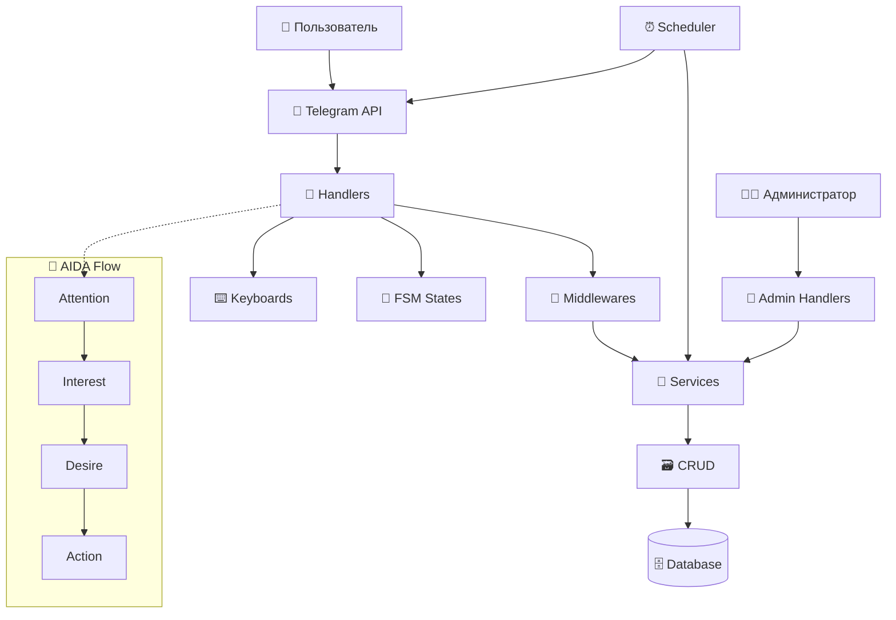

# 🏗️ Архитектура Проекта @imbabo_bot_v2

## 📋 Обзор Проекта

Telegram-бот для продажи солнцезащитных и имиджевых очков с полной автоматизацией процесса продаж, административной панелью и маркетинговыми механиками по модели AIDA.

## 🗂️ Структура Проекта

```
imbabo_bot_v2/
├── 📁 app/                          # Основное приложение
│   ├── 📁 handlers/                 # Обработчики команд и сообщений
│   │   ├── 📁 admin/               # Административные обработчики
│   │   │   ├── __init__.py
│   │   │   ├── catalog.py          # Управление каталогом
│   │   │   ├── main.py             # Главное меню админа
│   │   │   ├── orders.py           # Управление заказами
│   │   │   ├── promo.py            # Управление промокодами
│   │   │   ├── statistics.py       # Статистика и аналитика
│   │   │   └── users.py            # Управление пользователями
│   │   └── 📁 user/                # Пользовательские обработчики
│   │       ├── __init__.py
│   │       ├── cart.py             # Корзина покупок
│   │       ├── catalog.py          # Просмотр каталога
│   │       ├── common.py           # Общие команды (/start, /help)
│   │       ├── faq.py              # Часто задаваемые вопросы
│   │       ├── orders.py           # Оформление заказов
│   │       ├── personal_selection.py # Персональный подбор
│   │       └── reviews.py          # Отзывы пользователей
│   ├── 📁 keyboards/                # Клавиатуры для интерфейса
│   │   ├── __init__.py
│   │   ├── admin.py                # Админские клавиатуры
│   │   └── user.py                 # Пользовательские клавиатуры
│   ├── 📁 middlewares/              # Промежуточное ПО
│   │   ├── __init__.py
│   │   ├── admin_check.py          # Проверка прав администратора
│   │   ├── database.py             # Middleware для БД
│   │   └── subscription_check.py   # Проверка подписки на канал
│   ├── 📁 models/                   # Модели данных SQLAlchemy
│   │   ├── __init__.py
│   │   ├── base.py                 # Базовая модель
│   │   ├── category.py             # Модель категорий
│   │   ├── faq.py                  # Модель FAQ
│   │   ├── order.py                # Модели заказов
│   │   ├── product.py              # Модель товаров
│   │   ├── promo_code.py           # Модель промокодов
│   │   ├── review.py               # Модель отзывов
│   │   └── user.py                 # Модель пользователей
│   ├── 📁 services/                 # Бизнес-логика
│   │   ├── __init__.py
│   │   ├── cart_service.py         # Сервис корзины
│   │   ├── mailing_service.py      # Сервис рассылок
│   │   ├── order_service.py        # Сервис заказов
│   │   ├── personal_selection.py   # Сервис персонального подбора
│   │   ├── promo_service.py        # Сервис промокодов
│   │   └── subscription_service.py # Сервис проверки подписки
│   ├── 📁 states/                   # FSM состояния
│   │   ├── __init__.py
│   │   ├── admin_states.py         # Состояния админ панели
│   │   └── user_states.py          # Состояния пользователя
│   ├── 📁 utils/                    # Утилиты
│   │   ├── __init__.py
│   │   ├── decorators.py           # Декораторы
│   │   ├── formatters.py           # Форматирование сообщений
│   │   └── validators.py           # Валидация данных
│   └── scheduler.py                # Планировщик задач
├── 📁 config/                       # Конфигурация
│   ├── __init__.py
│   └── settings.py                 # Настройки приложения
├── 📁 database/                     # Работа с базой данных
│   ├── __init__.py
│   ├── crud.py                     # CRUD операции
│   └── database.py                 # Подключение к БД
├── 📁 alembic/                      # Миграции БД
│   ├── versions/                   # Файлы миграций
│   ├── env.py                      # Конфигурация Alembic
│   └── script.py.mako              # Шаблон миграций
├── 📁 images/                       # Изображения товаров
├── 📁 logs/                         # Логи приложения
├── 📁 static/                       # Статические файлы
├── 📄 main.py                       # Точка входа
├── 📄 run_dev.py                    # Запуск в режиме разработки
├── 📄 init_db.py                    # Инициализация БД
├── 📄 import_products.py            # Импорт товаров из JSON
├── 📄 products.json                 # Данные товаров
├── 📄 requirements.txt              # Зависимости Python
├── 📄 docker-compose.yml            # Docker конфигурация
├── 📄 Dockerfile                    # Docker образ
├── 📄 Makefile                      # Команды для разработки
├── 📄 alembic.ini                   # Конфигурация миграций
├── 📄 .env                          # Переменные окружения
└── 📄 README.md                     # Документация
```

## 🔧 Описание Модулей

### 🎯 Основное Приложение (`app/`)

#### 📨 Обработчики (`handlers/`)

**Административные обработчики (`admin/`):**
- `main.py` - Главное меню администратора, навигация по функциям
- `catalog.py` - Управление каталогом: добавление/редактирование категорий и товаров
- `orders.py` - Просмотр и управление заказами, изменение статусов
- `promo.py` - Создание и управление промокодами
- `statistics.py` - Просмотр статистики продаж и пользователей
- `users.py` - Управление пользователями бота

**Пользовательские обработчики (`user/`):**
- `common.py` - Базовые команды: /start, /help, приветствие
- `catalog.py` - Просмотр каталога товаров по категориям
- `personal_selection.py` - Персональный подбор очков по критериям
- `cart.py` - Управление корзиной покупок
- `orders.py` - Оформление заказов, сбор данных доставки
- `reviews.py` - Сбор отзывов от пользователей
- `faq.py` - Часто задаваемые вопросы

#### ⌨️ Клавиатуры (`keyboards/`)
- `user.py` - Inline и Reply клавиатуры для пользователей
- `admin.py` - Клавиатуры административной панели

#### 🔄 Промежуточное ПО (`middlewares/`)
- `database.py` - Автоматическое подключение к БД для каждого запроса
- `admin_check.py` - Проверка прав администратора
- `subscription_check.py` - Проверка подписки на канал

#### 🗃️ Модели данных (`models/`)
- `base.py` - Базовая модель с общими полями
- `user.py` - Пользователи: ID, имя, контакты, состояние FSM
- `category.py` - Категории товаров
- `product.py` - Товары: название, описание, цена, фото, атрибуты
- `order.py` - Заказы и их состав
- `promo_code.py` - Промокоды и их использование
- `review.py` - Отзывы пользователей
- `faq.py` - Вопросы и ответы

#### 🔧 Сервисы (`services/`)
- `cart_service.py` - Логика работы с корзиной
- `order_service.py` - Обработка заказов, расчет стоимости
- `personal_selection.py` - Алгоритм подбора товаров
- `promo_service.py` - Применение промокодов
- `mailing_service.py` - Массовые рассылки
- `subscription_service.py` - Проверка подписки на канал

#### 🔄 Состояния FSM (`states/`)
- `user_states.py` - Состояния пользователя: подбор, заказ, отзыв
- `admin_states.py` - Состояния админа: создание товара, промокода

#### 🛠️ Утилиты (`utils/`)
- `decorators.py` - Декораторы для обработчиков
- `formatters.py` - Форматирование сообщений и данных
- `validators.py` - Валидация пользовательского ввода

#### ⏰ Планировщик (`scheduler.py`)
- Автоматические рассылки
- Напоминания о брошенных корзинах
- Автопостинг в канал

### ⚙️ Конфигурация (`config/`)
- `settings.py` - Настройки бота: токены, БД, админы, каналы

### 🗄️ База данных (`database/`)
- `database.py` - Подключение к PostgreSQL/SQLite
- `crud.py` - CRUD операции для всех моделей

### 🔄 Миграции (`alembic/`)
- Управление схемой базы данных
- Версионирование изменений

## 🎯 Архитектурные Принципы

### 🔄 Модель AIDA
Каждый этап воронки реализован в соответствующих модулях:
- **Attention** (Внимание): `common.py`, автопостинг
- **Interest** (Интерес): `catalog.py`, `personal_selection.py`
- **Desire** (Желание): метафорические описания, промокоды
- **Action** (Действие): `cart.py`, `orders.py`

### 🏗️ Слоистая Архитектура
1. **Представление**: Handlers + Keyboards
2. **Бизнес-логика**: Services
3. **Данные**: Models + CRUD
4. **Инфраструктура**: Database + Config

### 🔄 FSM (Finite State Machine)
Управление состояниями диалогов:
- Пошаговый сбор данных
- Контроль пользовательского ввода
- Возможность отмены операций

### 🔧 Dependency Injection
- Автоматическое внедрение зависимостей через middleware
- Изоляция компонентов
- Упрощение тестирования

## 🚀 Технологический Стек

- **Язык**: Python 3.8+
- **Фреймворк бота**: aiogram 3.x
- **База данных**: PostgreSQL (SQLite для разработки)
- **ORM**: SQLAlchemy 2.0
- **Миграции**: Alembic
- **Планировщик**: APScheduler
- **Контейнеризация**: Docker
- **Логирование**: Python logging

## 📊 Схема Взаимодействия Модулей



## 🔐 Безопасность

- Проверка прав администратора по Telegram ID
- Валидация всех пользовательских данных
- Защита от SQL-инъекций через ORM
- Логирование всех операций

## 📈 Масштабируемость

- Модульная архитектура
- Асинхронная обработка
- Возможность горизонтального масштабирования
- Кэширование через Redis (опционально)

## 🧪 Тестирование

- Юнит-тесты для сервисов
- Интеграционные тесты для handlers
- Тестирование FSM состояний
- Моки для внешних API

Эта архитектура обеспечивает:
- ✅ Простоту разработки и поддержки
- ✅ Высокую производительность
- ✅ Надежность и отказоустойчивость
- ✅ Возможность расширения функционала